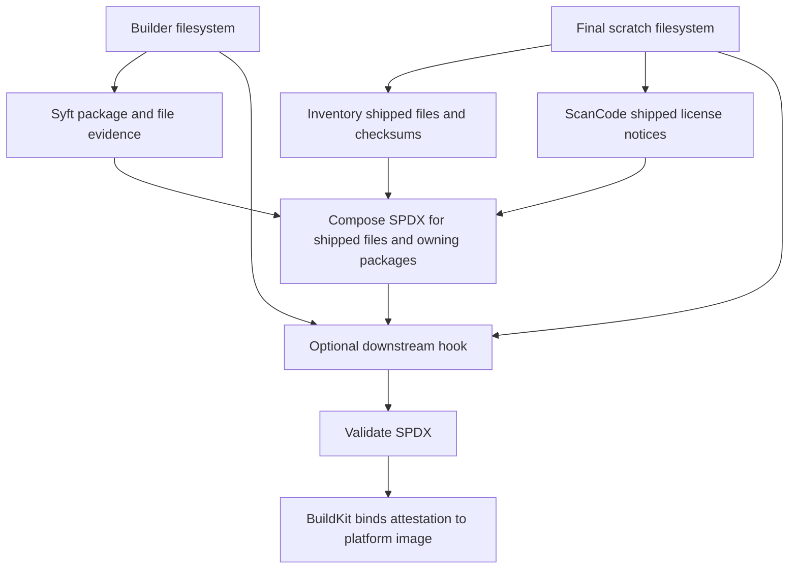

# Extension image SBOMs

Scratch extension images omit the installed-package database. Scanning only
scratch loses package identities; scanning the builder alone includes tools
that are not shipped. This generator matches shipped files to Syft's builder
package evidence and adds ScanCode findings from shipped license notices.
Bake and BuildKit build the image and attach the resulting SBOM and provenance.



## Coverage and licenses

Files with an identifiable owner retain a package `CONTAINS` relationship.
Ambiguous or unmatched files remain unassigned SPDX file records with checksums
and any scanned license findings. There is no catch-all package.

For owned files, ScanCode findings contribute to `licenseInfoFromFiles` and can
fill an unknown `licenseDeclared`. Custom licenses retain ScanCode reference
text when available, otherwise `NOASSERTION`. Package consumers such as Trivy
report package licenses; file-level findings on unassigned files remain
available to consumers that inspect SPDX files.

The document covers the extension payload, including copied system libraries
and `/licenses` notices. Scan the PostgreSQL base image separately.

## Inspect and validate

Use an immutable extension image index digest and the actual publishing
repository and branch. GitHub release workflows sign the index containing the
BuildKit attestations:

```bash
IMAGE='ghcr.io/OWNER/EXTENSION@sha256:INDEX_DIGEST'
cosign verify "$IMAGE" \
  --certificate-identity='https://github.com/OWNER/postgres-extensions-containers/.github/workflows/bake_targets.yml@refs/heads/main' \
  --certificate-oidc-issuer='https://token.actions.githubusercontent.com'

docker buildx imagetools inspect "$IMAGE" \
  --format '{{ json (index .SBOM "linux/amd64").SPDX }}' \
  > extension-amd64.spdx.json
trivy sbom --scanners vuln,license extension-amd64.spdx.json
```

Replace `linux/amd64` with `linux/arm64` for the other platform. Single-platform
Buildx output uses `{{ json .SBOM.SPDX }}`. Buildx extraction does not itself
verify publisher identity. `cosign verify-attestation` is not the retrieval
path for these embedded statements.

Validate raw SPDX JSON or a generator statement with the pinned SPDX Tools:

```bash
python3 -m venv /tmp/cnpg-spdx-venv
/tmp/cnpg-spdx-venv/bin/pip install -r sbom-generator/requirements-validation.txt
/tmp/cnpg-spdx-venv/bin/python sbom-generator/spdx_validation.py extension-amd64.spdx.json
```

The command exits nonzero on invalid output. SPDX validation checks document
conformance, not whether all components or licenses have been identified.
`trivy image` scans the filesystem; it does not automatically consume an
embedded BuildKit SBOM. Use `trivy sbom` for the extracted inventory.

## Downstream hook

Place a Python file at `/usr/local/share/cnpg-sbom/augment_spdx.py` in the builder:

```dockerfile
COPY sbom/augment_spdx.py /usr/local/share/cnpg-sbom/augment_spdx.py
```

```python
from hooks import HookContext

def augment_spdx(document: dict, context: HookContext) -> dict:
    return document
```

The hook runs after file selection and license composition. Its context exposes
`api_version` (1), `extension_name`, `platform`, `builder_path`, `final_path`, and
`builder_document`, the complete unfiltered Syft SPDX dictionary. Treat that
builder document as read-only evidence. The supplied `document` contains the
final inventory; the hook may modify it or return a replacement.

Hooks execute trusted Python code in the generator environment without a
sandbox. The builder and final filesystem mounts are read-only. Dependencies
installed only in the builder are not available to the hook; precomputed JSON
and standard-library processing need no additional generator dependencies.

An absent hook leaves the document unchanged. Hook failures stop generation.
The generator validates the completed SPDX after augmentation and writes one
in-toto statement. BuildKit supplies the final image subject and OCI attestation
layout. Downstream hooks must establish that their added components and licenses
belong to shipped artifacts; SPDX validation cannot establish this coverage.
The hook and builder evidence need not be copied into the final image.

## Local development

Ordinary local Bake builds use BuildKit's default scanner when `sbom_generator`
is empty. To exercise this generator, build its image in a registry accessible
to BuildKit, then set `sbom_generator` to that image reference. Add
`ARG BUILDKIT_SBOM_SCAN_STAGE=builder` after the Dockerfile syntax directive,
matching CI's preparation. This exposes builder evidence; passing a build
argument alone does not enable [stage scanning](https://docs.docker.com/build/metadata/attestations/sbom/#scan-stages).

```bash
docker buildx build --tag REGISTRY/cnpg-sbom-generator:dev --push sbom-generator
sbom_generator=REGISTRY/cnpg-sbom-generator:dev \
  docker buildx bake -f docker-bake.hcl -f EXTENSION/metadata.hcl TARGET
/tmp/cnpg-spdx-venv/bin/python -m unittest discover -s sbom-generator/tests
```

The composer is an internal module with one input contract: raw builder SPDX,
canonical inventory from `final_inventory()`, a target platform, and optional
ScanCode/evidence data. Required scanner fields use direct access so incompatible
output fails rather than silently dropping evidence. Final inventory records
contain `name` and SHA1/SHA256 `checksums`; filenames and hashes are produced by
the filesystem walk. There is no composer CLI or scanner-fixture environment
variable. Tests inject scanner fixtures at the function boundary.

Generation logs report phase progress. Syft emits a heartbeat every ten seconds;
ScanCode diagnostics are streamed directly. Large copyright notices are split
for scanning and findings mapped back to the original shipped files.

## Generator release and test builds

Release identity uses source commits and image digests, without major/minor
versions. Each adopting repository publishes
`ghcr.io/<lowercase-owner>/cnpg-sbom-generator` using `sbom-generator.yml`.

| Trigger | Result |
| --- | --- |
| Pull request | Checks using a disposable local registry; no GHCR publication |
| Relevant push to `main` | Publish/reuse commit image, check it, promote to `latest` if still current |
| Manual `publish=false` | Checks only |
| Manual `publish=true` | Publish/reuse commit image, check it, promote to `test` |

The publisher reuses `sha-<full-commit>` tags rather than overwriting them.
Tags are immutable by workflow convention; the captured digest identifies the
content. Both architectures are checked before promotion. Failures leave aliases
unchanged; manual publication never moves `latest`.

To publish a test, the workflow must exist on the default branch. Select the
branch to test and take the checked digest from the run summary:

```bash
gh workflow run sbom-generator.yml --repo OWNER/postgres-extensions-containers \
  --ref BRANCH -f publish=true
```

A temporary consumer branch can pin `test@sha256:<digest>`. Stable consumers use
`latest@sha256:<digest>`, allowing Renovate to propose new checked digests.
Keep the publishing owner and Renovate Docker annotation aligned. Run the affected
extension checks before accepting a digest update. Do not merge test pins into
stable consumers.

Renovate also tracks the SPDX validator, grouped with ScanCode for compatibility
review. Tool updates must satisfy ScanCode's dependency constraints and pass the
generator checks. To rebuild with changed dependencies, make a new commit. To
roll back, restore a previous checked consumer digest and hold the update until
fixed; retain commit images needed for rollback.

On first publication, check the organization's package creation setting,
package visibility, repository access, and anonymous pulls. Public creation
permissions do not prove that every package is public. Configure read access
for consumer workflows and Renovate as required.

The image revision label and SPDX creator identify the generator source commit.
Local builds may supply `--build-arg SBOM_GENERATOR_REVISION=<commit>`;
otherwise the revision is `unknown`. Consumers pin the generator image digest.
Each repository publishes and consumes its own image. The adoption plan is
recorded in [Release design](RELEASE-DESIGN.md).
