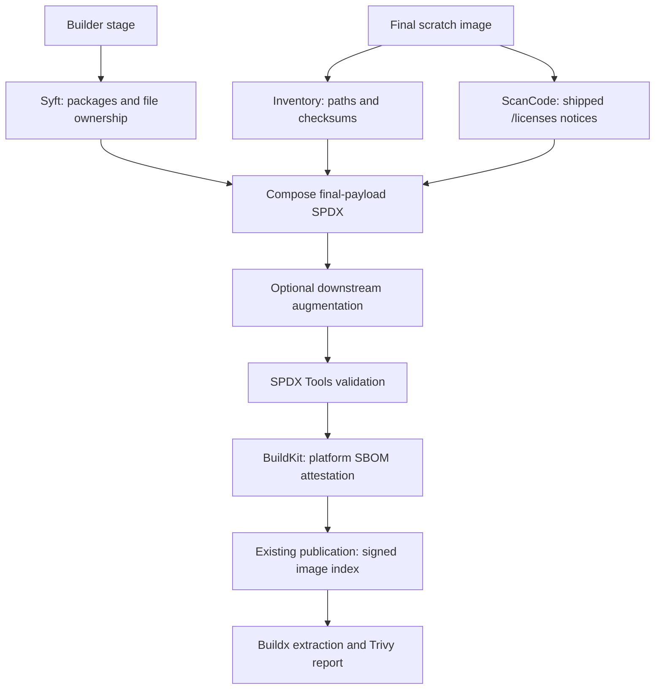

# Inspect extension SBOMs

Extension images include an SPDX 2.3 software bill of materials (SBOM) for each
platform. It lists shipped files, their checksums, identifiable Debian packages,
and license evidence from the notices in `/licenses`. This includes copied
system libraries. The PostgreSQL base image has its own SBOM and should be
scanned separately.

## Verify the image and extract its SBOM

You need Cosign, Docker Buildx, and Trivy. Use the published image **index digest**
so verification and extraction refer to the same content. Replace the placeholders
below with the image's publisher, extension, and digest:

```bash
IMAGE='ghcr.io/OWNER/EXTENSION@sha256:INDEX_DIGEST'
cosign verify "$IMAGE" \
  --certificate-identity='https://github.com/OWNER/postgres-extensions-containers/.github/workflows/bake_targets.yml@refs/heads/main' \
  --certificate-oidc-issuer='https://token.actions.githubusercontent.com'

docker buildx imagetools inspect "$IMAGE" \
  --format '{{ json (index .SBOM "linux/amd64").SPDX }}' \
  > extension-amd64.spdx.json
```

The signing identity above is for this repository's Debian build workflow on
`main`. For a testing image or another publisher, use the exact workflow and ref
you trust. Extraction alone does not verify the publisher. This follows the
[CloudNativePG signature and attestation guidance](https://cloudnative-pg.io/docs/1.30/security/#image-signatures),
with the extension publisher's identity.

Use `linux/arm64` for ARM images. For single-platform Buildx output, use
`{{ json .SBOM.SPDX }}` instead. Buildx retrieves the embedded BuildKit statement;
`cosign verify-attestation` is not its retrieval command.

## Inspect and verify build provenance

BuildKit records detailed build inputs and parameters alongside the SBOM:

```bash
docker buildx imagetools inspect "$IMAGE" \
  --format '{{ json (index .Provenance "linux/amd64").SLSA }}'
```

Published Debian extension images also carry separately signed provenance from
CNPG's SLSA container generator. Verify the image index digest against the
expected source repository and branch:

```bash
slsa-verifier verify-image "$IMAGE" \
  --source-uri github.com/OWNER/postgres-extensions-containers \
  --source-branch main
```

For testing images, use the branch that built them. This applies to images
published after the SLSA workflow was introduced; older images have only BuildKit
provenance. The SLSA job runs for both testing and production image repositories.
Mirrors must preserve its separate signed attestation as well as the image index.
The [SLSA container generator](https://github.com/slsa-framework/slsa-github-generator/blob/v2.1.0/internal/builders/container/README.md)
requires explicit opt-in for private source repositories because it publishes
repository identity to the public transparency log. This workflow leaves that
opt-in disabled.

## Report vulnerabilities and licenses with Trivy

```bash
trivy sbom --scanners vuln,license extension-amd64.spdx.json

# Save a machine-readable report, including the package inventory.
trivy sbom --scanners vuln,license --list-all-pkgs \
  --format json --output extension-report.json extension-amd64.spdx.json
```

See the [example Trivy output](../examples/trivy-sbom-examples.txt) for vulnerability
and package-license tables. It is a historical local pgAgent build, illustrating
the report format rather than current findings or the current extension catalog.

Use [`trivy sbom`](https://trivy.dev/docs/latest/target/sbom/) with the extracted
SPDX. A direct `trivy image` scan of the scratch image cannot recover its missing
Debian package database. Findings also depend on Trivy's database and supported
package ecosystems; an empty vulnerability report is not proof of safety.

### Reading license results

- Package identities and existing license declarations come from Syft's builder
  scan. ScanCode scans the shipped `/licenses` files and records findings on
  those files. For owned files, findings also populate package
  `licenseInfoFromFiles` and fill missing or unknown `licenseDeclared` values.
- Trivy reports package licenses. Unmatched files remain in SPDX with checksums
  and scanned license evidence, without an invented owner. Their file-level
  findings may not appear in Trivy's package report.
- `NOASSERTION` means no value was established for that field. `LicenseRef-*`
  identifiers refer to `hasExtractedLicensingInfos`, with ScanCode reference text
  when available. Original notices remain in the image.
- Trivy's `UNKNOWN` license classification does not mean the license expression
  is absent. Shared Debian copyright files can produce broad expressions;
  inspect the SPDX evidence and shipped notice for context.

## How it works — reviewer guide

The final image is built `FROM scratch`: it retains extension files and libraries,
but no package database. The generator uses the builder's package evidence to
identify the files actually shipped, excluding packages with no matched files.
It runs as a BuildKit scanner; its tools are not added to the extension image.



Ownership requires matching SHA256 content. Exact paths and shared path suffixes
rank candidates; ambiguous matches stay unclaimed. The composer retains owning
packages and their relationships, adds Debian distribution context for consumers,
and merges license evidence. It does not infer ownership from a license-directory
name. Large copyright files are split for scanning, then findings are mapped back
to their original file paths.

### Where to review

| Area | Entry points |
| --- | --- |
| Scanner lifecycle, final inventory, ScanCode invocation, BuildKit statement | [generator.py](generator.py) |
| File ownership, package selection, license composition, document identity | [compose.py](compose.py) |
| Optional hook and its context | [hooks.py](hooks.py) |
| Final SPDX conformance check | [spdx_validation.py](spdx_validation.py), [validator pin](requirements-validation.txt) |
| Scanner image and dependencies | [Dockerfile](Dockerfile) |
| Extension integration | [docker-bake.hcl](../docker-bake.hcl), [bake_targets.yml](../.github/workflows/bake_targets.yml) |
| Generator checks, publication, and digest updates | [sbom-generator.yml](../.github/workflows/sbom-generator.yml), [release.py](release.py), [renovate.json](../renovate.json) |
| Unit checks and real BuildKit/SPDX/Trivy fixture | [tests](tests), [integration](tests/integration) |

CI selects the digest-pinned scanner and inserts
`ARG BUILDKIT_SBOM_SCAN_STAGE=builder` into the Dockerfile so BuildKit exposes the
builder stage. Ordinary local Bake builds use the default scanner when
`sbom_generator` is empty. BuildKit produces detailed provenance (`mode=max`); the SLSA reusable workflow
adds signed provenance for each published index. Testing provenance gates
production copying; production provenance is generated at the destination.
This SBOM generator produces the SPDX predicate only.

### Downstream augmentation

A builder may supply `/usr/local/share/cnpg-sbom/augment_spdx.py` with
`augment_spdx(document, context) -> dict`. The hook runs after composition and
before validation. [HookContext](hooks.py) exposes API version 1, extension name,
platform, builder/final paths, and the complete Syft builder document.

The hook executes trusted Python in the generator environment. Builder-installed
dependencies are unavailable there; downstream builds can prepare JSON evidence
for the hook to read. Missing hooks leave the document unchanged; hook errors or
invalid final SPDX fail the build. SPDX validation checks conformance, not whether
added components actually belong to the payload.

PGRX is a downstream consumer of this interface: it supplies Cargo component and
license evidence. The core generator has no Cargo or PGRX processing dependency.
The [fixture hook](tests/integration/fixture/augment_spdx.py) demonstrates adding
a package that Trivy can report.

### Local checks

From the repository root:

```bash
python3 -m venv /tmp/cnpg-spdx-venv
/tmp/cnpg-spdx-venv/bin/pip install -r sbom-generator/requirements-validation.txt
/tmp/cnpg-spdx-venv/bin/python -m unittest discover -s sbom-generator/tests
/tmp/cnpg-spdx-venv/bin/python sbom-generator/spdx_validation.py extension-amd64.spdx.json
```

The validator accepts extracted SPDX or the generator's in-toto statement and
exits nonzero on invalid output. Native AMD64 and ARM64 CI checks also build the
scanner and exercise a real BuildKit attestation, Debian notice ownership, hook
augmentation, and Trivy license reporting.

For test publication, consumer digest updates, and adoption, see
[Generator release and test builds](RELEASE-DESIGN.md).
