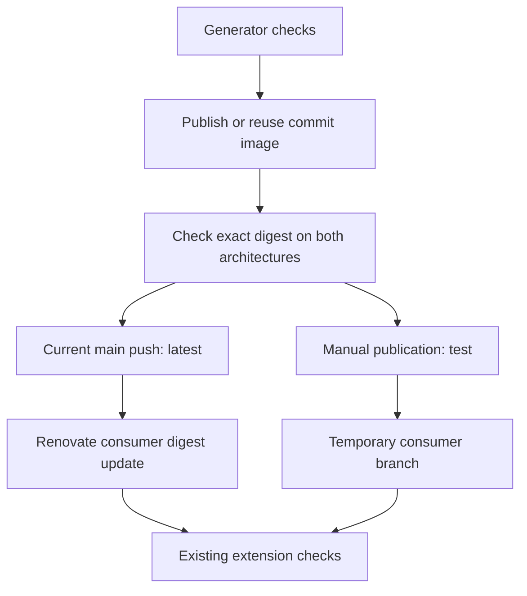

# Generator release design

The implemented workflow uses source commits and checked image digests as release
identities. Publication, test commands, Renovate updates and rollback instructions
are maintained in the [generator README](README.md#generator-release-and-test-builds).

Each repository owns its generator package and consumer digest updates. The
first adopter is `cnpg-extensions/postgres-extensions-containers`, where the
generator builds Debian and downstream PGRX packages. A core-generator PR is
opened against `cloudnative-pg/postgres-extensions-containers` in parallel.
If accepted, upstream publishes its own generator and uses it for its Debian
builds. Upstream adoption does not switch downstream image pins; PGRX remains
downstream and uses the optional generic hook.

The existing Bake, BuildKit attestation, GitHub signing and runtime workflows
remain the extension publication architecture. Generator publication provides
checked input to those workflows, without another extension release pipeline.
