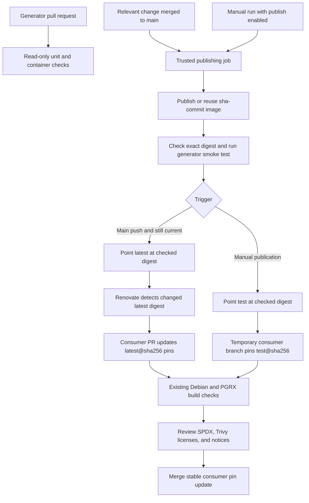
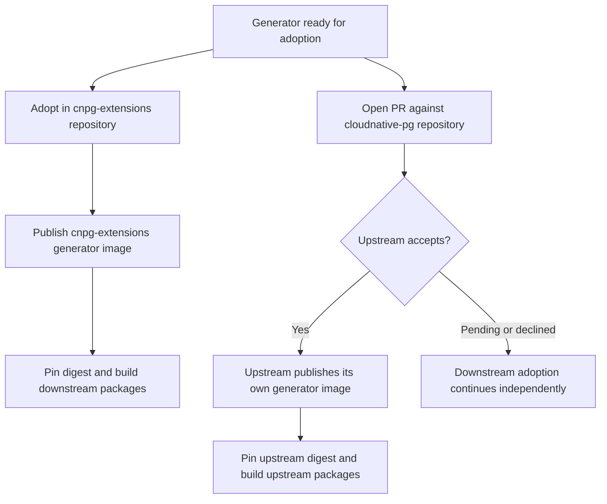

# SBOM generator: simple publication and digest updates

Status: **accepted design; implementation under validation**, 2026-10-02. The workflow and README implement this design; upstream adoption remains a proposal.

## 1. Recommendation

Use one generator publishing workflow and one GHCR image per adopting repository, with three kinds of tags:

- `sha-<full-commit>` identifies a published build of a source commit.
- `latest` points to a checked build from `main`.
- `test` points to a checked build explicitly published by a maintainer for testing.

Consumers always use a tag **and an image digest**. Renovate proposes updates to the digest behind `latest`; maintainers review and merge those updates. A generator publication therefore does not change an extension build until its consumer pin changes.

There are no major/minor versions, release branches, version files, GitHub Releases, or automatic cross-repository commits. The source commit and image digest provide the release identity. A workflow summary provides the copyable reference and links to checks.

Adopt the generator first in `cnpg-extensions/postgres-extensions-containers` and use its published image to build packages there. At the same time, open a PR against `cloudnative-pg/postgres-extensions-containers`. If accepted, upstream will publish and consume its own generator build. Downstream adoption does not depend on upstream acceptance.

## 2. Overall architecture



The generator owns image scanning, SPDX composition, and its generic hook contract. Downstream PGRX owns Cargo-specific integration and its extension build matrix. Publishing the upstream generator should not require the entire downstream Rust build suite.

Use the existing extension build and signing workflows for consumer verification. This proposal adds no second extension release pipeline and no additional SBOM format.

### Repository boundaries

| Location | Responsibility |
| --- | --- |
| `ardentperf-labs` working repository | Develop and trial the workflow in its own GHCR namespace |
| `cnpg-extensions/postgres-extensions-containers` (first adopter) | Publish its generator, pin it in its package builds, integrate PGRX, and validate extension images |
| `cloudnative-pg/postgres-extensions-containers` (parallel PR) | If accepted, publish its own core generator and pin that build in its upstream Debian extension workflow |

Derive the publisher image as `ghcr.io/<lowercase repository owner>/cnpg-sbom-generator`:

- Development trials: `ghcr.io/ardentperf-labs/cnpg-sbom-generator`.
- Initial adoption and package builds: `ghcr.io/cnpg-extensions/cnpg-sbom-generator`.
- Upstream, if accepted: `ghcr.io/cloudnative-pg/cnpg-sbom-generator`, subject to upstream agreement on the package name.

Publication and consumption happen independently within each adopting repository: a generator change publishes that repository's image, then Renovate opens a separate PR updating its consumer digest pins. The first rollout updates the Debian and PGRX pins in `cnpg-extensions`. If the upstream PR is accepted, upstream builds and pins its own image. Upstream acceptance does not automatically switch downstream consumers to the upstream image; any later switch would be a separate decision. Image names and Renovate annotations must always identify the same publisher. PGRX code and its workflow remain downstream.

### Adoption sequence



Use one designated publishing repository per owner/package name. Publishing another repository under the same owner must not silently share that package. Configure public package visibility and repository access during initial setup so consumers can pull it without new cross-repository credentials.

## 3. Tags, digests, and rebuilds

| Reference | Meaning | Update rule |
| --- | --- | --- |
| `sha-<40-character commit>` | Build artifact from that source commit | Never overwrite after successful publication |
| `latest` | Checked main-branch build | Updated only by an eligible main push |
| `test` | Most recently promoted manual test build | Updated only by explicit manual publication |
| `latest@sha256:<digest>` | Stable consumer input | Changed through a reviewed consumer PR |
| `test@sha256:<digest>` | Trial consumer input | Used on a temporary testing branch |

Pin the **multi-platform index digest**, covering `linux/amd64` and `linux/arm64`, rather than an architecture-specific manifest digest. BuildKit then selects the matching platform from that fixed index.

Commit-tag immutability is a publishing convention enforced by the workflow, not a claim that GHCR tags are inherently immutable. The digest is the content identity.

Before building, inspect the commit tag. If it already exists, reuse its digest and rerun the publication checks. Verify the expected platforms and source/revision labels. Fail on authentication or registry errors; only a confirmed missing tag permits a new publication. Serialize publishers so two jobs cannot race to create the same tag.

A commit tag can exist even if a later smoke test fails. It is an artifact locator, not proof of qualification: only a successful check permits promotion to `latest` or `test`. Retrying a failed check can reuse that artifact. Changing its contents requires a new commit.

Dependencies can change between builds, so rebuilding the same source is not assumed to reproduce identical bytes. An intentional dependency refresh or rebuild receives a new commit; it must not overwrite an existing commit tag. This imposes no reproducibility requirement on upstream extension SQL generation.

## 4. One workflow, explicit event behavior

Keep `.github/workflows/sbom-generator.yml` and its existing `publish` boolean input.

| Event | Checks/build | Publish image | Move alias |
| --- | --- | --- | --- |
| Pull request | Yes, without registry writes | No | None |
| Relevant push to `main` | Yes | Commit tag | `latest`, after checks and freshness guard |
| Manual, `publish=false` | Yes | No | None |
| Manual, `publish=true` | Yes | Commit tag | `test`, even when the selected branch is `main` |

Retain path filtering for generator code and its workflow. Include any shared test/configuration file actually used by those checks. Consumer pin changes alone should not republish the generator.

GitHub requires the dispatch workflow to exist on the default branch; operators can then select a branch when starting a manual run. Initial workflow rollout must account for that requirement. [GitHub manual workflow documentation](https://docs.github.com/en/actions/how-tos/manage-workflow-runs/manually-run-a-workflow)

### Job structure and permissions

Use two jobs in the same workflow:

1. **Check:** runs for all supported events with `contents: read`. Install the pinned validator, run generator unit tests, build a local native-platform generator image, and exercise the small integration fixture described below.
2. **Publish:** depends on check success; runs only for main pushes or explicit manual publication. Give this job `contents: read` and `packages: write`; use `GITHUB_TOKEN` for its own repository's GHCR package.

Keep top-level permissions empty and checkout credential persistence disabled. Pull requests do not receive publishing credentials. A maintainer should manually publish only reviewed code from a trusted branch; dispatching a branch executes that branch's workflow and code. Fork contributors can publish in their own namespace. No `pull_request_target` publication path is needed.

### Publish sequence

1. Determine the image name, full source SHA, and alias from the event.
2. Reuse the existing commit image, or build and push both platforms under its commit tag. Preserve the existing source and revision labels.
3. Capture the index digest directly from build metadata, or inspect it when reusing an image. All following checks use that digest.
4. Confirm both expected platform manifests exist. Run the generator integration fixture against the published digest on the runner's native architecture. Keep multi-platform build coverage; native ARM runtime coverage remains a separate project task.
5. If checks pass, promote the exact index to the appropriate alias, without rebuilding.
6. Inspect the alias and confirm that it resolves to the checked index digest.
7. Write a job summary with source SHA, index digest, immutable reference, alias reference, tested architecture, and links to check results. Retain the small fixture SPDX and reports as ordinary workflow artifacts.

For example, alias promotion can use:

```sh
docker buildx imagetools create \
  --tag "$image:$alias" \
  "$image@$digest"
```

Here `digest` includes `sha256:`. Use a single existing index as the source and do not add annotations or change its manifest contents during promotion. Docker documents that this operation copies a single index; inspect the resulting digest to verify the contract. [Docker imagetools documentation](https://docs.docker.com/reference/cli/docker/buildx/imagetools/create/)

### Concurrent runs

Use one publishing concurrency group per repository/package, with cancellation of a running publisher disabled. Read-only checks can retain per-ref concurrency. Do not depend on queued publication jobs running in FIFO order or every queued run being retained.

Immediately before moving `latest`, compare the build SHA with the current `main` head. If it has advanced, leave the commit artifact available and skip moving `latest`; report why. A newer relevant main run will publish, or a maintainer can make a small follow-up commit if the intervening change did not trigger publication. This deliberately favors avoiding an old rerun rolling back `latest`.

`test` is a convenience pointer, so subsequent manual runs can replace it. Tests remain tied to their captured digest even if that alias moves. No consumer should run using a bare `test` or `latest` tag.

## 5. Minimum useful publication checks

Retain the existing unit suite and add one small integration fixture that exercises the generator through BuildKit's SBOM-generator interface. It should cover a known package, a file with license evidence, and a generic hook-provided package. Use a tiny fixed input rather than compiling a real PGRX extension in this upstream job.

Check that:

- BuildKit produces an extractable SPDX attestation from the generator image.
- The document passes the pinned SPDX validator.
- Expected packages, files, and relationships are present.
- Hook-supplied license expressions survive composition, and a known package license is visible in a pinned Trivy report.

The fixture should check meaningful content rather than compare an entire generated document byte for byte. It should allow legitimate `NOASSERTION` values. Full Debian/PGRX ownership, Cargo license, and bundled-notice coverage belongs in the consumer integration checks.

The generator already validates SPDX during generation. The publication fixture additionally checks the exported document from the actual container/BuildKit path. These are proposed gates, not a claim that the new workflow has been tested.

## 6. Trying a change before merging it

1. Push a reviewed generator change to a working branch.
2. Run the generator workflow on that branch with `publish=true`.
3. Copy `ghcr.io/<owner>/cnpg-sbom-generator:test@sha256:<index-digest>` from the successful summary.
4. On a temporary consumer branch, replace the existing generator references with that exact reference. Update both the Debian and PGRX pins when both exist in the repository.
5. Run the existing affected extension build workflows. Examine independent SPDX validation, Trivy package/license output, and notices retained in final images. Use production CNPG base images.
6. Review the results, then merge the generator change. The main build publishes its own commit artifact and moves `latest`.
7. Let Renovate propose the stable consumer digest update, verify that exact published artifact, and merge the consumer PR.

Do not merge temporary `test` references into the stable consumer branch. The merge commit can differ from the tested branch commit, and its build may produce a different digest; do not assume the trial digest equals the final main digest.

No new workflow input is needed to thread a test generator through every consumer. Editing the two existing pins on a test branch uses the same path as a real update. For local work, reuse the existing Bake `sbom_generator` variable and PGRX preparation `--generator` option.

The current consumer workflows already treat changes to their reusable workflow files as shared build changes: changing the Debian pin selects affected Debian builds; changing the PGRX pin selects all PGRX extensions. Verify that behavior during implementation. Do not assume an untrusted fork PR can run a workflow requiring registry writes; use the repository's trusted integration-run process.

## 7. Renovate and digest updates

### Generator consumption

Keep the explicit pins where they are:

- `.github/workflows/bake_targets.yml`: `sbom_generator`.
- `.github/workflows/pgrx_targets.yml`: `SBOM_GENERATOR` (downstream only).

Both downstream stable references use the `cnpg-extensions` image name, `latest` tag, and the same index digest. Keep the existing annotated Docker regex manager and configure a single generator update group with human review, so the downstream repository receives one PR updating both occurrences. If adopted upstream, the core-only repository tracks its own `cloudnative-pg` image in its consumer pin. The two repositories' digests need not match, even when their generator source is equivalent.

Illustrative annotation and value, with placeholders:

```yaml
# renovate: datasource=docker depName=ghcr.io/OWNER/cnpg-sbom-generator
sbom_generator: ghcr.io/OWNER/cnpg-sbom-generator:latest@sha256:DIGEST
```

Renovate can update a digest when the associated tag changes. Retaining `latest` gives it the tracking target while the digest fixes the build input. Do not change production tracking to a fixed commit tag, which would stop discovering later generator commits. [Renovate Docker documentation](https://docs.renovatebot.com/docker/)

Validate extraction against both workflow files when implementing this change. Ensure existing package rules do not disable these digest updates or silently automerge them. Publication needs no bot token for opening consumer PRs; Renovate uses its existing installation in the consuming repository.

### SPDX validator and generator dependencies

Retain the explicit Renovate annotation and extraction for `spdx-tools` in `sbom-generator/requirements-validation.txt`. Both workflow validation and the generator image install that requirements file. This keeps the SPDX validator updateable rather than hiding its version in a shell command or container layer.

The current pin is `spdx-tools==0.8.2`, matching ScanCode Toolkit 32.5.0's dependency constraint. Renovate must continue proposing validator version updates, but a proposal is not evidence that it is compatible with the installed ScanCode release. Group ScanCode and validator updates when compatible releases are available; otherwise leave the incompatible update unmerged and explain the constraint. Do not suppress validator tracking or bypass dependency resolution to make a version bump pass.

Retain the existing tool-version and immutable-image tracking, including Skopeo. Changes to scanner/tool dependencies flow through a source PR, generator checks where relevant, a new generator publication, and then the consumer digest PR. Avoid adding a scheduled rebuild mechanism as a second update path.

The existing custom regex managers can extract annotated versions and digests; extending their existing patterns is preferable to introducing a separate dependency inventory. [Renovate regex-manager documentation](https://docs.renovatebot.com/modules/manager/regex/)

## 8. Failure, rollback, and retention

- **Build/check failure:** fail the run and leave aliases unchanged. A pushed commit artifact may remain for diagnosis.
- **Failure after alias promotion:** inspect the alias on retry and finish verification; reuse the same commit digest. Publication is not a registry transaction, so report which steps succeeded.
- **Bad consumer update:** revert the consumer digest change to the previous known-good digest. Hold Renovate's replacement PR until the issue is fixed. Publish the correction through a new source commit.
- **Old test build:** retrieve it through its commit tag or recorded digest after `test` has moved.
- **Retention:** retain commit-tagged generator images, especially all digests referenced by supported consumers. Initially add no automatic package cleanup. Workflow reports can use normal artifact retention because the image and source remain addressable.

Rollback does not require rebuilding the old generator or moving a shared alias. A pinned older digest continues to identify the old artifact.

## 9. Implementation scope

| File or setting | Proposed change |
| --- | --- |
| `.github/workflows/sbom-generator.yml` | Separate check/publish permissions; event-specific aliases; commit-tag reuse; capture digest; smoke gate; serialized publication; freshness guard; summary |
| `sbom-generator/tests/` and a small fixture helper | Exercise the actual container/BuildKit interface and validate exported SPDX and representative Trivy licenses |
| `renovate.json` | Reuse current extraction; group generator digest occurrences; require review; preserve validator/tool tracking |
| `.github/workflows/bake_targets.yml` | Adopt the chosen publisher's checked `latest@digest` and matching annotation |
| `.github/workflows/pgrx_targets.yml` | Same pin update downstream; preserve the existing preparation record's frozen digest |
| GHCR repository/package settings | Confirm owning repository, visibility, and publishing access |

Implement core changes on `work/sbom-validation`, then rebase `work/pgrx-validation` onto it and apply downstream integration changes. Keep the upstream patch understandable without PGRX-specific publishing logic.

Before enabling publication, verify these scenarios: read-only PR; manual check-only run; manual test publication that leaves `latest` unchanged; successful main publication; failed smoke check; rerun reusing the original digest; stale main run; both platform manifests; Renovate updating both consumer pins; Renovate discovering the validator version; and consumer rollback to a retained digest.

## 10. Upstream review and remaining decisions

Present this as a proposed lightweight image publication policy, with a small working example and check evidence. CloudNativePG's contribution guidelines apply across its repositories and point contributors to its code-of-conduct and AI policies; the final contribution should follow those and the target repository's workflow conventions. [CloudNativePG contribution guidelines](https://github.com/cloudnative-pg/governance/blob/main/CONTRIBUTING.md)

Initial adoption is in `cnpg-extensions/postgres-extensions-containers`, with an upstream PR opened in parallel against `cloudnative-pg/postgres-extensions-containers`. Seek upstream maintainer agreement on the contribution, its own GHCR package name, and any signing or provenance requirements. Reuse the repository's policy if an additional publication step is required rather than introducing a separate signing design here. Existing downstream extension signing remains its own responsibility.

This design does not complete the outstanding latest-code licensing validation, native ARM verification, Cargo graph verification, or final documentation cleanup. Those remain tracked project work. General docs cleanup stays deferred until development is finished.
